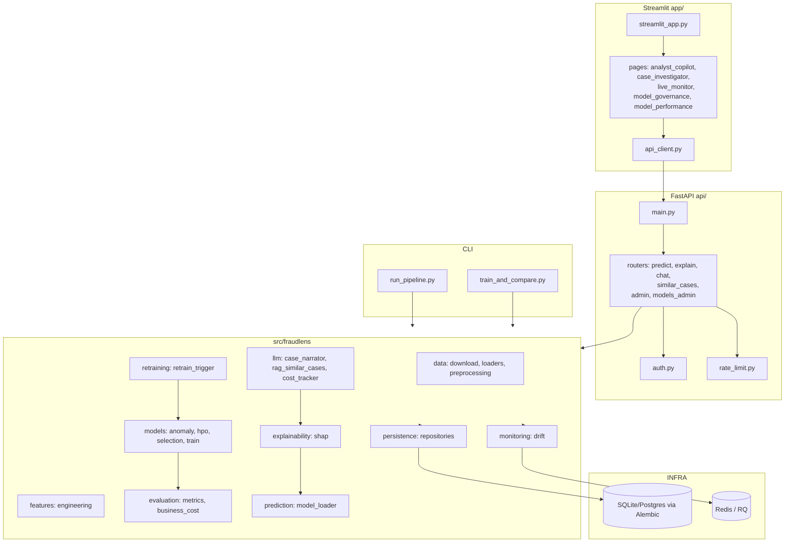

# FraudLens — Architecture

> Textual architecture of the Credit Card Fraud Detection system (as-is; no behavior changes).

## System Overview

FraudLens is a layered, production-grade fraud-detection platform with four primary surfaces:

1. **CLI / Pipeline** — `run_pipeline.py` and `train_and_compare.py` drive data → feature → train → evaluate → register flows.
2. **API (FastAPI)** — REST endpoints for prediction, explanation, LLM case narration, similar-case RAG retrieval, admin and model governance. Protected by API-key auth and rate limiting.
3. **Dashboard (Streamlit)** — analyst copilot, case investigator, live monitor, model performance and governance pages; talks to the API via `app/api_client.py`.
4. **ML Core (`src/fraudlens`)** — data, features, models, evaluation, explainability, LLM, monitoring, persistence, prediction, retraining.



## Layering Rules (as observed)

- **API layer** (`api/`) depends on `src/fraudlens/`; never the reverse.
- **Persistence** is isolated behind a repository pattern (`persistence/repositories/base.py` + typed repositories).
- **Dashboard** (`app/`) talks to the system only through the API client — no direct DB access.
- **LLM usage** is wrapped (`llm/case_narrator.py`) with a cost tracker to bound spend.
- **Configuration** is centralized in `src/fraudlens/config.py` (Pydantic settings) and API-level config in `api/state.py`.

## Data Flow (prediction path)

```
POST /predict ──► auth ──► rate_limit ──► router ──► model_loader ──► features.engineering
                                                          │
                                                          ▼
                                             model inference (XGBoost)
                                                          │
                              ┌───────────────────────────┼───────────────────────────┐
                              ▼                           ▼                           ▼
                     explainability (SHAP)        persistence (prediction repo)   drift monitoring
                              │
                              ▼
                     LLM case narrator + RAG similar cases (optional)
                              │
                              ▼
                        JSON response
```

## Deployment

- `Dockerfile` + `docker-compose.yml` + `infra/` for containerized deployment.
- `alembic` manages schema migrations.
- DVC tracks the raw dataset (`data/raw/creditcard.csv.dvc`); models are checksummed (`models/*.sha256`).
