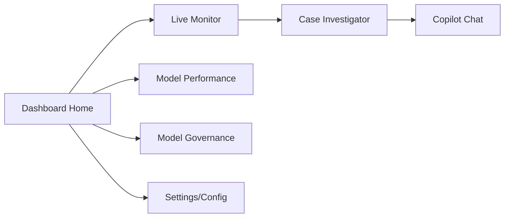
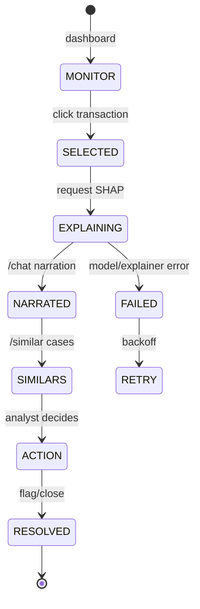
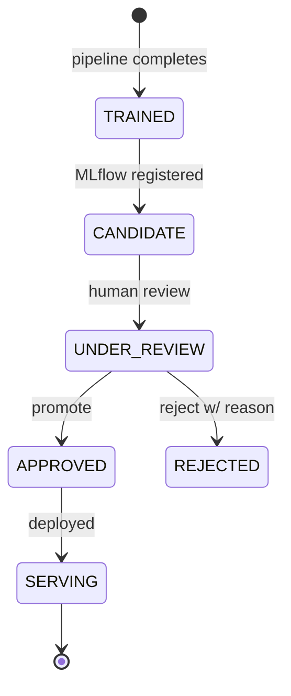

# AppFlow — FraudLens: Application Flow

| Field | Value |
| --- | --- |
| Version | v0.1 |
| Last Updated | 2026-08-06 |
| Owner | PM / QA |
| Status | In Review |

---

## 1. Screen Inventory

| SCR-### | Screen | Purpose | Entry | Exit | Auth |
| --- | --- | --- | --- | --- | --- |
| SCR-001 | Live Monitor | Real-time risk stream | dashboard home | drill into case | Yes |
| SCR-002 | Case Investigator | Transaction detail + explanation | live monitor, search | take action | Yes |
| SCR-003 | Model Performance | Benchmarks + charts | nav | — | Yes |
| SCR-004 | Model Governance | Promote/reject candidates | nav | — | Admin |
| SCR-005 | Analyst Copilot | Chat with LLM narrator | nav | — | Yes |

## 2. Navigation Map

## 3. Detailed Flow per Journey

### Investigate a case

### Governance flow

## 4. Empty / Loading / Error States

| Screen | Empty | Loading | Error |
| --- | --- | --- | --- |
| Live Monitor | "No transactions" | stream spinner | API error banner |
| Case Investigator | "Select a case" | skeleton | 404 case |
| Copilot | "Ask about a case" | typing | LLM down → deterministic fallback |
| Governance | "No candidates" | — | registry error |

## 5. Edge Cases & Branching Logic

| IF condition | THEN route |
| --- | --- |
| No ANTHROPIC_API_KEY | Skip LLM, use template narration |
| Index stale | Rebuild on scheduled cadence |
| Drift > threshold (0.05) | Alert + queue retrain |
| Feedback volume > threshold | Queue retrain |
| Candidate PR-AUC ≤ current | Reject at gate (if gate on) |
| API key missing + dev mode | Dev mode no auth |

## 6. Notifications & Re-engagement

| Trigger | Channel | Destination |
| --- | --- | --- |
| Drift detected | Alert (dashboard/logs) | risk team |
| Retrain complete | Registry + dashboard | ML engineer |
| High-risk transaction | Live Monitor stream | analyst |

## 7. Cross-Platform Deltas

N/A — web dashboard + API only.

## 8. Related Documents

| Document | Relationship |
| --- | --- |
| [PRD.md](../product/PRD.md) | US-001…007 |
| [TechSpec.md](../technical/TechSpec.md) | Components |
| [Design.md](Design.md) | Screen design |
| [Schema.md](../technical/Schema.md) | Entities |
| [ImplementationPlan.md](../project/ImplementationPlan.md) | Tasks |
| [Tracker.md](../project/Tracker.md) | Status |
| [Rules.md](../project/Rules.md) | Standards |
| [API.md](../technical/API.md) | Endpoints |
| [SecurityAndCompliance.md](../technical/SecurityAndCompliance.md) | Access |
| [Testing.md](../technical/Testing.md) | Tests |
| [Deployment.md](../technical/Deployment.md) | Env |
| [Glossary.md](../reference/Glossary.md) | Vocabulary |
| [RiskRegister.md](../project/RiskRegister.md) | Risks |
