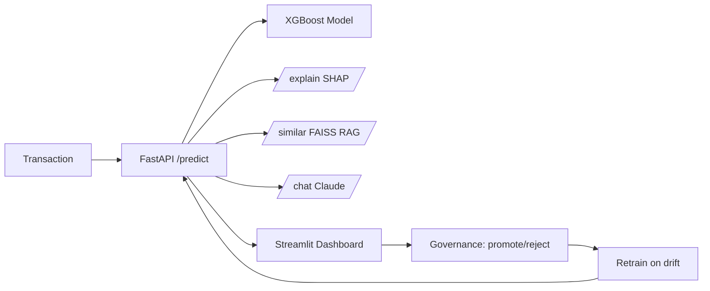

# PRD — FraudLens: Credit Card Fraud Detection Platform

| Field | Value |
| --- | --- |
| Version | v0.1 |
| Last Updated | 2026-08-06 |
| Owner | Product Manager |
| Status | In Review |

---

## 1. Executive Summary

FraudLens is a production-grade credit card fraud detection system. It trains and compares multiple ML models (XGBoost, LightGBM, Random Forest, Logistic Regression, Isolation Forest), explains every prediction with SHAP, narrates cases in plain English via an LLM (Anthropic Claude), retrieves historical fraud precedents via FAISS RAG, and exposes everything through a FastAPI server and a 5-page Streamlit dashboard. It includes model governance (promote/reject candidates), automated retraining on drift/feedback triggers with MLflow tracking, observability (Prometheus, Jaeger, Grafana), and Kubernetes-ready deployment.

## 2. Problem Statement

- **User pain:** Fraud analysts are overwhelmed by alerts; models are opaque; retraining is manual and ungoverned.
- **Evidence/context:** ~2% fraud rates make accuracy meaningless; PR-AUC and recall matter. Analysts need explanations and precedents to act.
- **Cost of not solving it:** Fraud losses, false-positive fatigue, model drift going unnoticed.

## 3. Goals & Non-Goals

| Goal | Metric | Target |
| --- | --- | --- |
| Detect fraud accurately | PR-AUC on validation | ≥ 0.85 (config-tunable, benchmarked) |
| Explain every prediction | SHAP coverage | 100% of predictions |
| Enable analyst action | Case narratives + similar cases | Every case has narration + top-k similar |
| Govern model updates | Human-gated promotion | 100% of promotions reviewed |
| Auto-retrain on drift | Drift detection + retrain trigger | KS/drift threshold 0.05 |

### Non-Goals (v1)
- Real-time transaction blocking (v1 is risk-scoring + review).
- Direct card network integrations.
- Multi-tenant SaaS; single-tenant deployment.
- Fully autonomous model promotion (human gate required).

## 4. Target Users & Personas

| Persona | Role | Goals | Frustrations | Quote | Tech Comfort |
| --- | --- | --- | --- | --- | --- |
| Asha — Fraud Analyst | Reviews flagged transactions | Decide fast, defend decisions | Black-box models | "Why is this flagged?" | Medium |
| Dev — ML Engineer | Trains + evaluates models | Reproducible benchmarking | Metric confusion | "PR-AUC, not accuracy." | High |
| Rohan — Risk Manager | Governs model changes | Audit + promote/reject | Untracked retrains | "Who approved this model?" | Medium |

## 5. User Stories

| ID | As a... | I want... | So that... | Priority | Acceptance Criteria |
| --- | --- | --- | --- | --- | --- |
| US-001 | Analyst | `/predict` per transaction | I get a risk score | P0 | Score + status returned |
| US-002 | Analyst | `/explain` SHAP explanation | I know why | P0 | SHAP values per feature |
| US-003 | Analyst | `/similar` RAG cases | I see precedents | P1 | Top-k historical cases |
| US-004 | Analyst | `/chat` case narration | I get plain-English summary | P1 | Narrated case from tool data |
| US-005 | Risk manager | promote/reject candidates | models stay governed | P0 | Human gate enforced |
| US-006 | ML engineer | drift + feedback retraining | model stays current | P1 | Trigger + retrain + candidate |
| US-007 | Analyst | dashboard monitoring | I see live risk | P1 | Live monitor page |

## 6. Feature List

| ID | Epic | Feature | Description | Priority | Status |
| --- | --- | --- | --- | --- | --- |
| REQ-001 | Training | Multi-model training | 5 model families + Optuna | P0 | Done |
| REQ-002 | Training | Benchmarking | PR-AUC-first comparison | P0 | Done |
| REQ-003 | Inference | `/predict` API | Risk scoring | P0 | Done |
| REQ-004 | Explainability | SHAP explanations | Per-prediction features | P0 | Done |
| REQ-005 | LLM | Case narration | Claude plain-English summaries | P1 | Done |
| REQ-006 | RAG | Similar-case retrieval | FAISS top-k | P1 | Done |
| REQ-007 | Governance | Model registry + gating | MLflow + human promotion | P0 | Done |
| REQ-008 | Retraining | Drift/feedback triggers | Automated candidate training | P1 | Done |
| REQ-009 | Dashboard | 5-page Streamlit UI | Live, cases, perf, governance, copilot | P0 | Done |
| REQ-010 | Observability | Metrics/tracing | Prometheus, Jaeger, Grafana | P1 | Done |

## 7. User Journeys (high level)

## 8. Success Metrics / KPIs

| Metric | Target | Measurement |
| --- | --- | --- |
| North Star: fraud captured per review | ≥ 80% of injected fraud | Simulation harness |
| Prediction explainability | 100% SHAP | API coverage |
| Retraining turnaround | < 24h from drift trigger | Pipeline timings |
| Governance compliance | 100% promotions human-approved | Registry audit |
| API latency (predict) | p95 < 200ms | Prometheus |

## 9. Assumptions & Dependencies

- Kaggle credentials optional (synthetic dataset auto-generated otherwise).
- `ANTHROPIC_API_KEY` for LLM features; `DATABASE_URL`, `REDIS_URL` with fallbacks.
- MLflow tracking URI reachable.
- PostgreSQL + Redis for state.

## 10. Risks

Top 3 (full list in ../project/RiskRegister.md):
1. **LLM hallucination in narratives** — mitigated by narration from tool/deterministic outputs only.
2. **Model drift undetected** — mitigated by KS-drift detection + alerting.
3. **Dependency availability (structlog/imblearn/lightgbm)** — env setup issues documented; CI installs full deps.

## 11. Release Criteria

- [ ] `make train` produces a model with PR-AUC benchmark.
- [ ] `/predict`, `/explain`, `/similar`, `/chat` respond correctly.
- [ ] Governance flow: candidate → human approve/reject.
- [ ] Dashboard renders 5 pages.
- [ ] Docker compose boots API + dashboard + MLflow.
- [ ] Metrics endpoint + tracing work.

## 12. Open Questions

| Question | Owner | Resolve by |
| --- | --- | --- |
| Wire retrained candidates to production serving automatically? | Eng Lead | Release 1.1 |
| Add real-time blocking (decline) mode? | PM | Release 2.0 |

## 13. Related Documents

| Document | Relationship |
| --- | --- |
| [TechSpec.md](../technical/TechSpec.md) | Architecture, stack |
| [AppFlow.md](../design/AppFlow.md) | Dashboard + API flows |
| [Design.md](../design/Design.md) | Dashboard design system |
| [Schema.md](../technical/Schema.md) | Data model |
| [ImplementationPlan.md](../project/ImplementationPlan.md) | Build plan |
| [Tracker.md](../project/Tracker.md) | Task status |
| [Rules.md](../project/Rules.md) | Standards |
| [API.md](../technical/API.md) | Endpoint contracts |
| [SecurityAndCompliance.md](../technical/SecurityAndCompliance.md) | Data protection |
| [Testing.md](../technical/Testing.md) | Test strategy |
| [Deployment.md](../technical/Deployment.md) | Deployment |
| [Glossary.md](../reference/Glossary.md) | Vocabulary |
| [RiskRegister.md](../project/RiskRegister.md) | Risks |
