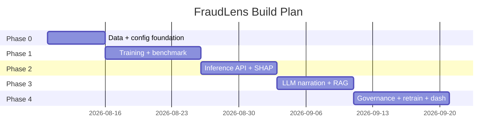
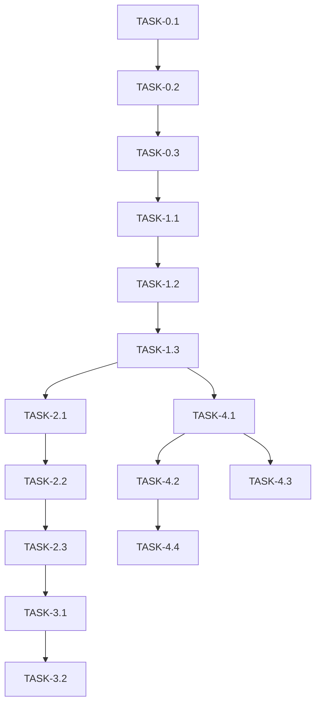

# ImplementationPlan — FraudLens: Phased Build Plan

| Field | Value |
| --- | --- |
| Version | v0.1 |
| Last Updated | 2026-08-06 |
| Owner | Engineering Lead |
| Status | In Review |

---

## 1. Build Philosophy

Facts-first ML: get a reproducible training pipeline + benchmark before any serving. Then serve, then explain, then narrate/retrieve, then govern. Every model change flows through MLflow + human gate.

## 2. Phase Overview

## 3. Phase Breakdown

### Phase 0: Foundation
- Goal: env-driven config + synthetic data path.
- Exit: `make setup-data` produces 5,000-tx dataset.

| TASK-# | Description | Depends on | Owner | Est. | Maps to |
| --- | --- | --- | --- | --- | --- |
| TASK-0.1 | pydantic-settings config (env) | — | Eng | 2d | config |
| TASK-0.2 | Data ingestion + synthetic generator | TASK-0.1 | Data | 3d | REQ-001 |
| TASK-0.3 | Preprocessing + resampling | TASK-0.2 | Data | 2d | REQ-001 |

### Phase 1: Training & Benchmark
- Goal: reproducible PR-AUC benchmark across 5 model families.
- Exit: benchmark artifact + charts.

| TASK-# | Description | Depends on | Owner | Est. | Maps to |
| --- | --- | --- | --- | --- | --- |
| TASK-1.1 | Model registry + training loop | TASK-0.3 | ML | 4d | REQ-001 |
| TASK-1.2 | Benchmark + metric charts | TASK-1.1 | ML | 3d | REQ-002 |
| TASK-1.3 | MLflow tracking + artifact persist | TASK-1.2 | ML | 3d | REQ-007 |

### Phase 2: Serving & Explainability
- Goal: /predict + /explain live.
- Exit: API tests pass.

| TASK-# | Description | Depends on | Owner | Est. | Maps to |
| --- | --- | --- | --- | --- | --- |
| TASK-2.1 | FastAPI scaffold + auth/rate limit/CORS | TASK-1.3 | Eng | 3d | REQ-003 |
| TASK-2.2 | /predict endpoint | TASK-2.1 | Eng | 2d | REQ-003 |
| TASK-2.3 | SHAP explainer + /explain | TASK-2.2 | ML | 3d | REQ-004 |

### Phase 3: Narration & RAG
- Goal: /chat + /similar.
- Exit: fallbacks verified.

| TASK-# | Description | Depends on | Owner | Est. | Maps to |
| --- | --- | --- | --- | --- | --- |
| TASK-3.1 | Claude narrator + fallback | TASK-2.3 | Eng | 3d | REQ-005 |
| TASK-3.2 | FAISS index + /similar | TASK-3.1 | ML | 3d | REQ-006 |

### Phase 4: Governance & Dashboard
- Goal: human-gated promotion, retrain triggers, 5-page dashboard.
- Exit: full loop demo.

| TASK-# | Description | Depends on | Owner | Est. | Maps to |
| --- | --- | --- | --- | --- | --- |
| TASK-4.1 | Governance UI + promotion gate | TASK-1.3 | Eng | 4d | REQ-007 |
| TASK-4.2 | Drift detection + retrain triggers | TASK-4.1 | ML | 3d | REQ-008 |
| TASK-4.3 | Streamlit 5 pages | TASK-4.1 | FE | 5d | REQ-009 |
| TASK-4.4 | Prometheus/Jaeger/Grafana | TASK-4.2 | DevOps | 3d | REQ-010 |

## 4. Dependency Graph

## 5. Environment & Tooling Setup Checklist

- [ ] `pip install -r requirements.txt` (includes structlog, imblearn, lightgbm)
- [ ] `.env` from `.env.example`
- [ ] `make setup-data` (Kaggle or synthetic)
- [ ] `make train`
- [ ] `make api` / `make dashboard`
- [ ] MLflow reachable (or local sqlite URI)

## 6. Rollout Strategy

- Serve v1 model behind governance gate; canary in staging.
- Drift alerts page → retrain → candidate → human promote.
- Rollback: pin previous MLflow artifact; re-serve.

## 7. Definition of Done (global)

- [ ] Tests written + passing
- [ ] Docs updated (this suite)
- [ ] Reviewed
- [ ] No secrets committed
- [ ] Model artifact registered in MLflow

## 8. Related Documents

| Document | Relationship |
| --- | --- |
| [PRD.md](../product/PRD.md) | REQ mapping |
| [TechSpec.md](../technical/TechSpec.md) | Components |
| [AppFlow.md](../design/AppFlow.md) | Flows |
| [Schema.md](../technical/Schema.md) | Data model |
| [Design.md](../design/Design.md) | Dashboard tasks |
| [Tracker.md](Tracker.md) | Status |
| [Rules.md](Rules.md) | Standards |
| [API.md](../technical/API.md) | Contract |
| [SecurityAndCompliance.md](../technical/SecurityAndCompliance.md) | Security |
| [Testing.md](../technical/Testing.md) | Tests |
| [Deployment.md](../technical/Deployment.md) | Rollout |
| [Glossary.md](../reference/Glossary.md) | Vocabulary |
| [RiskRegister.md](RiskRegister.md) | Risks |
