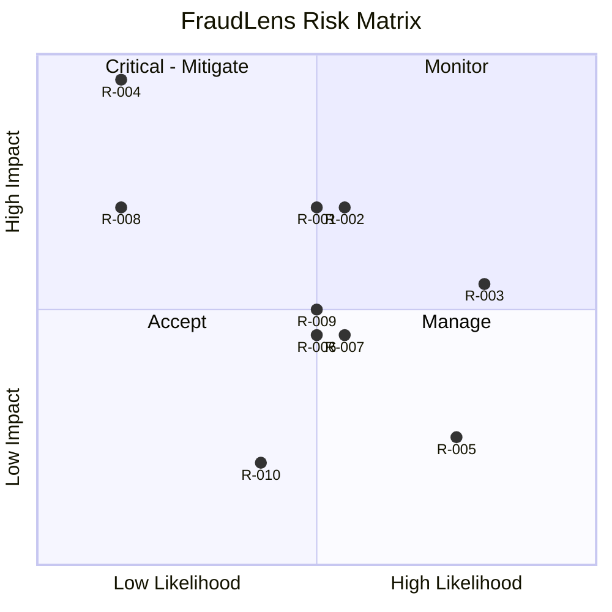

# RiskRegister — FraudLens: Known Risks

| Field | Value |
| --- | --- |
| Version | v0.1 |
| Last Updated | 2026-08-06 |
| Owner | PM / Eng Lead |
| Status | In Review |

---

| Risk | Likelihood | Impact | Score | Mitigation | Owner | Status |
| --- | --- | --- | --- | --- | --- | --- |
| R-001 LLM hallucination in narratives | Medium | High | 6 | Narration from deterministic tool outputs + fallback | Eng | Mitigating |
| R-002 Model drift undetected | Medium | High | 6 | KS-drift detection + alerts (threshold 0.05) | ML | Mitigating |
| R-003 Class imbalance skews selection | High | Medium | 6 | PR-AUC metric + SMOTE | ML | Mitigating |
| R-004 Card data leak | Low | Critical | 8 | Masking + data minimization | Security | Mitigating |
| R-005 Missing deps break local tests | High | Low | 3 | Full requirements install; CI installs all | Eng | 🔴 Open (BLK-001) |
| R-006 MLflow down | Medium | Medium | 4 | Local sqlite fallback | DevOps | Accepted |
| R-007 FAISS index staleness | Medium | Medium | 4 | Rebuild cadence | ML | Open |
| R-008 Governance bypass | Low | High | 5 | Human gate + audit trail | Security | Mitigating |
| R-009 API abuse/DoS | Medium | Medium | 4 | Rate limits + key auth | Security | Mitigating |
| R-010 Kaggle/source unavailability | Medium | Low | 2 | Synthetic generator fallback | Data | Mitigating |

## Risk Matrix

## Related Documents

| Document | Relationship |
| --- | --- |
| [PRD.md](../product/PRD.md) | Top-3 risks |
| [SecurityAndCompliance.md](../technical/SecurityAndCompliance.md) | R-004/008/009 |
| [TechSpec.md](../technical/TechSpec.md) | R-006/007 |
| [AppFlow.md](../design/AppFlow.md) | Flows |
| [Design.md](../design/Design.md) | Design |
| [Schema.md](../technical/Schema.md) | Data |
| [ImplementationPlan.md](ImplementationPlan.md) | Mitigations |
| [Tracker.md](Tracker.md) | BLK-001 |
| [Rules.md](Rules.md) | Standards |
| [API.md](../technical/API.md) | R-009 |
| [Testing.md](../technical/Testing.md) | Test coverage |
| [Deployment.md](../technical/Deployment.md) | Rollback |
| [Glossary.md](../reference/Glossary.md) | Vocabulary |
