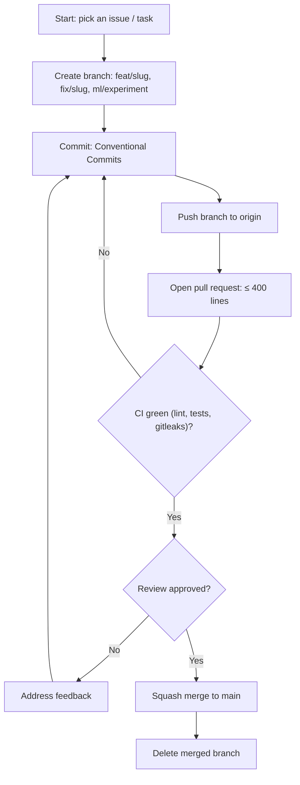

# Rules — FraudLens: Coding Standards & AI-Agent Operating Rules

| Field | Value |
| --- | --- |
| Version | v0.1 |
| Last Updated | 2026-08-06 |
| Owner | Engineering Lead |
| Status | In Review |

---

## 1. Guiding Principles

1. Reproducibility over speed — every experiment traceable via MLflow.
2. PR-AUC over accuracy — the selection metric is configured, not guessed.
3. Explainability everywhere — every prediction must be explainable.
4. Governance before serving — no model goes live without human gate.
5. No silent failures — structured logging (structlog).
6. Small PRs only.
7. Data minimization — mask PII in logs and LLM input.

## 2. Code Style

- Python 3.10+, type hints required.
- Formatter: black; linter: ruff; isort.
- Structure:

```
src/fraudlens/
  config.py         # pydantic-settings
  data/preprocessing.py
  models/train.py   # trainer
  models/evaluate.py
  explain/shap.py
  rag/faiss_index.py
  llm/narrator.py
api/
  main.py           # FastAPI
  schemas.py        # Pydantic
  logging_config.py
  limiter.py
tests/
```

## 3. Git Workflow

- Branches: `feat/<slug>`, `fix/<slug>`, `ml/<experiment>`.
- Commits: Conventional Commits.
- PRs: ≤ 400 lines; CI green (lint, tests, gitleaks).
- Merge: squash to main.

## 4. Testing Requirements

- Minimum coverage: 70%.
- MUST have tests: preprocessing, model training interface, API endpoints (predict/explain), rate limiting, schemas.
- See [Testing.md](../technical/Testing.md).

## 5. AI Agent Operating Rules

- Always read Tracker.md and ImplementationPlan.md before starting.
- Never mark a task 🟢 Done without tests passing.
- Never invent requirements not in ../product/PRD.md/../technical/TechSpec.md — flag ambiguity.
- Always update ../technical/Schema.md if data model changes.
- Never commit secrets/API keys; env vars per ../technical/SecurityAndCompliance.md.
- Always register model changes in MLflow and route through governance.
- State conflicts rather than silently picking one.

## 6. Security Baseline Rules

- API key auth + rate limiting + CORS (configurable dev mode).
- Mask card numbers; never log full card data.
- LLM receives case summaries, not raw PII rows.
- Dependencies scanned weekly (Dependabot).
- No hardcoded secrets.

## 7. Documentation Rules

- New endpoints → ../technical/API.md same PR.
- Schema changes → ../technical/Schema.md same PR.
- New env vars → ../technical/Deployment.md.

## 8. Prohibited Patterns

| Anti-pattern | Why |
| --- | --- |
| Selecting models by accuracy on imbalanced data | Misleading |
| Logging raw card numbers | PCI risk |
| Direct model promotion without gate | Uncontrolled drift |
| Hardcoded API keys | Leak |
| Blanket `except Exception` | Hides failures |

## 9. Escalation Rules

**Ask a human when:** model promotion, threshold changes, new data sources, LLM provider changes, PII handling changes.
**Decide autonomously:** pipeline refactors, tests, logging, config tuning.

## Git / PR Workflow



## 10. Related Documents

| Document | Relationship |
| --- | --- |
| [Testing.md](../technical/Testing.md) | Test requirements |
| [SecurityAndCompliance.md](../technical/SecurityAndCompliance.md) | Security baseline |
| [PRD.md](../product/PRD.md) | Requirements |
| [TechSpec.md](../technical/TechSpec.md) | Architecture |
| [AppFlow.md](../design/AppFlow.md) | Flows |
| [Design.md](../design/Design.md) | Design |
| [Schema.md](../technical/Schema.md) | Data |
| [ImplementationPlan.md](ImplementationPlan.md) | Tasks |
| [Tracker.md](Tracker.md) | Status |
| [API.md](../technical/API.md) | Contract |
| [Deployment.md](../technical/Deployment.md) | Env vars |
| [Glossary.md](../reference/Glossary.md) | Vocabulary |
| [RiskRegister.md](RiskRegister.md) | Risks |
