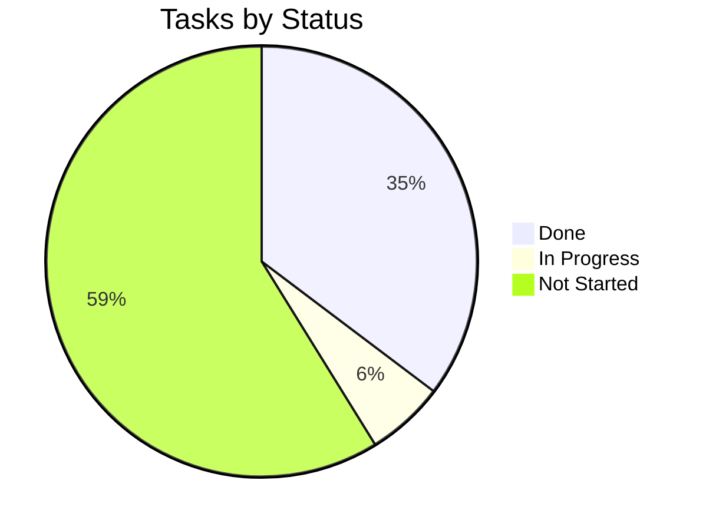

# Tracker — FraudLens: Living Status Tracker

| Field | Value |
| --- | --- |
| Version | v0.1 |
| Last Updated | 2026-08-06 |
| Owner | Engineering Lead |
| Status | In Review |

---

## 1. Snapshot Dashboard

| Metric | Value |
| --- | --- |
| Overall % Complete | 40% |
| Current Phase | Phase 2 |
| Tasks Done / Total | 6 / 17 |
| Blockers (open) | 1 |
| Days to Target Launch | 45 |

## 2. Status Legend

🟢 Done | 🟡 In Progress | 🔴 Blocked | ⚪ Not Started | 🔵 In Review

## 3. Phase Progress Bars

| Phase | Progress |
| --- | --- |
| Phase 0: Foundation | `[████████░░] 100%` |
| Phase 1: Training | `[████████░░] 100%` |
| Phase 2: Serving | `[████░░░░░░] 50%` |
| Phase 3: Narration/RAG | `[░░░░░░░░░░] 0%` |
| Phase 4: Governance/Dash | `[░░░░░░░░░░] 0%` |

## 4. Full Task Table

| TASK | Description | Status | Assignee | Start | Target | Actual | Notes |
| --- | --- | --- | --- | --- | --- | --- | --- |
| TASK-0.1 | Config (env) | 🟢 | Eng | 2026-07-01 | 2026-07-03 | — |  |
| TASK-0.2 | Data + synthetic | 🟢 | Data | 2026-07-04 | 2026-07-08 | — |  |
| TASK-0.3 | Preprocessing | 🟢 | Data | 2026-07-08 | 2026-07-10 | — |  |
| TASK-1.1 | Model registry + training | 🟢 | ML | 2026-07-11 | 2026-07-17 | — |  |
| TASK-1.2 | Benchmark + charts | 🟢 | ML | 2026-07-17 | 2026-07-21 | — |  |
| TASK-1.3 | MLflow tracking | 🟢 | ML | 2026-07-21 | 2026-07-24 | — |  |
| TASK-2.1 | FastAPI scaffold | 🟡 | Eng | 2026-07-25 | — | — | in progress |
| TASK-2.2 | /predict | ⚪ | Eng | — | — | — |  |
| TASK-2.3 | SHAP /explain | ⚪ | ML | — | — | — |  |
| TASK-3.1 | Claude narrator | ⚪ | Eng | — | — | — |  |
| TASK-3.2 | FAISS /similar | ⚪ | ML | — | — | — |  |
| TASK-4.1 | Governance UI | ⚪ | Eng | — | — | — |  |
| TASK-4.2 | Drift + retrain | ⚪ | ML | — | — | — |  |
| TASK-4.3 | Dashboard 5 pages | ⚪ | FE | — | — | — |  |
| TASK-4.4 | Observability | ⚪ | DevOps | — | — | — |  |

## 5. Blockers Log

| ID | Description | Raised | Owner | Impact | Status |
| --- | --- | --- | --- | --- | --- |
| BLK-001 | Local env missing deps (structlog/imblearn/lightgbm) → test collection errors | 2026-08-01 | Eng | Local test runs fail | 🔴 Open — full `pip install -r requirements.txt` |

## 6. Changelog

- 2026-08-06: **Documentation suite complete** — 14-file suite consolidated into `docs/`, categorized structure, cross-linked navigation, deployment/git/auth diagrams, quality gate passed (238/238), merged to `main`.
| Date | What shipped |
| --- | --- |
| 2026-08-06 | Docs suite v0.1 |
| 2026-07-24 | Phase 1 benchmark complete |

## 7. Burndown Summary

## 8. Next 3 Priorities

1. Finish TASK-2.1 — FastAPI scaffold + auth.
2. TASK-2.2 — /predict endpoint.
3. TASK-2.3 — SHAP /explain.

## 9. Related Documents

| Document | Relationship |
| --- | --- |
| [ImplementationPlan.md](ImplementationPlan.md) | Tasks |
| [PRD.md](../product/PRD.md) | Features |
| [TechSpec.md](../technical/TechSpec.md) | Components |
| [AppFlow.md](../design/AppFlow.md) | Flows |
| [Design.md](../design/Design.md) | Design |
| [Schema.md](../technical/Schema.md) | Data |
| [Rules.md](Rules.md) | Standards |
| [API.md](../technical/API.md) | Contract |
| [SecurityAndCompliance.md](../technical/SecurityAndCompliance.md) | Security |
| [Testing.md](../technical/Testing.md) | Tests |
| [Deployment.md](../technical/Deployment.md) | Deploy |
| [Glossary.md](../reference/Glossary.md) | Vocabulary |
| [RiskRegister.md](RiskRegister.md) | Risks |
