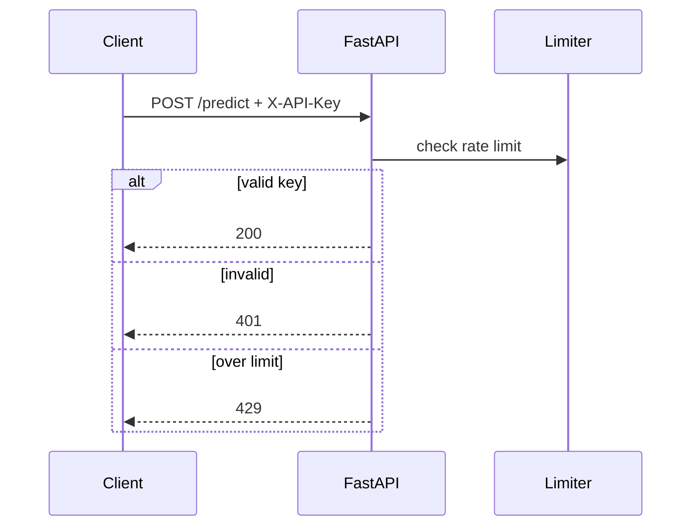

# API — FraudLens: API Reference

| Field | Value |
| --- | --- |
| Version | v0.1 |
| Last Updated | 2026-08-06 |
| Owner | Backend Engineer |
| Status | In Review |

---

## 1. Endpoint Inventory

| Method | Path | Auth | Description |
| --- | --- | --- | --- |
| POST | `/predict` | API key | Score single transaction |
| POST | `/predict/batch` | API key | Score multiple transactions |
| POST | `/explain` | API key | SHAP explanation |
| POST | `/similar` | API key | RAG similar cases |
| POST | `/chat` | API key | LLM case narration |
| GET | `/health` | None | Liveness |
| GET | `/metrics` | internal | Prometheus metrics |
| GET | `/model-info` | API key | Current model metadata |

## 2. Example: POST /predict

Request:

```json
{
  "features": {
    "amount": 4500.0,
    "merchant_category": 14,
    "hour": 3,
    "distance_from_home": 12.4
  }
}
```

Response:

```json
{
  "transaction_id": "tx_123",
  "risk_score": 0.92,
  "label": "fraud",
  "model_version": "xgboost_v3",
  "explanation_available": true
}
```

## 3. Example: POST /chat

Request: `{"transaction_id": "tx_123"}`
Response: `{"narration": "This transaction shows an unusual 4,500 INR purchase at 3 AM...", "source": "llm"}` (fallback `source: "template"`).

## 4. Error Codes

| Code | Meaning | Retry? |
| --- | --- | --- |
| 401 | Missing/invalid API key | No |
| 422 | Validation error (field detail) | No |
| 429 | Rate limited | Yes, backoff |
| 503 | Model unavailable | Yes |
| 500 | Internal | Yes |

## 5. Rate Limits

- Configurable via limiter (slowapi-style); API key + IP based.
- Dashboard refresh: 500ms default (DASHBOARD_REFRESH_MS).

## 6. Auth Flow



## 7. Versioning Policy

- v1 flat paths; versioning via URL prefix planned (e.g., /v1/predict).

## 8. Related Documents

| Document | Relationship |
| --- | --- |
| [TechSpec.md](TechSpec.md) | API layer |
| [Schema.md](Schema.md) | Data contracts |
| [SecurityAndCompliance.md](SecurityAndCompliance.md) | Auth + limits |
| [AppFlow.md](../design/AppFlow.md) | Dashboard → API |
| [PRD.md](../product/PRD.md) | Requirements |
| [Design.md](../design/Design.md) | Response rendering |
| [ImplementationPlan.md](../project/ImplementationPlan.md) | Tasks |
| [Tracker.md](../project/Tracker.md) | Status |
| [Rules.md](../project/Rules.md) | Standards |
| [Testing.md](Testing.md) | Contract tests |
| [Deployment.md](Deployment.md) | Deploy |
| [Glossary.md](../reference/Glossary.md) | Vocabulary |
| [RiskRegister.md](../project/RiskRegister.md) | Risks |
