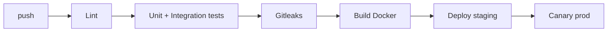

# Deployment — FraudLens: Environments, CI/CD, Rollback

| Field | Value |
| --- | --- |
| Version | v0.1 |
| Last Updated | 2026-08-06 |
| Owner | DevOps Engineer |
| Status | In Review |

---

## 1. Service Topology

| Service | Purpose | Port |
| --- | --- | --- |
| api | FastAPI | 8000 |
| dashboard | Streamlit | 8501 |
| mlflow | Tracking/registry | 5000 |
| postgres | DB | 5432 |
| redis | Cache/queue | 6379 |
| monitoring | Prometheus + Jaeger + Grafana | — |

## 2. CI/CD Pipeline

## 3. Environment Promotion

| Step | From | To | Trigger |
| --- | --- | --- | --- |
| 1 | main | staging | CI green |
| 2 | staging | prod | manual approval |

## 4. Rollback Procedure

- Pin previous MLflow artifact; re-serve model.
- Image revert for api/dashboard.
- Governance: demote model to candidate.

## 5. Feature Flags

- `FEATURE_LLM_NARRATOR`, `FEATURE_ANOMALY_SCORE`, `FEATURE_SHAP_EXPLANATION`, `FEATURE_CACHE_PREDICTIONS`, `FEATURE_RAG_RETRIEVAL` — env flags.
- `RETRAINING_ENABLED` — automated retrain on/off.

## 6. On-Call / Runbook

- **Predict 503:** model load failure → check MLflow artifact + serving.
- **LLM narration missing:** check ANTHROPIC_API_KEY + quota.
- **Drift alert:** page risk team; queue retrain.
- **Slow API:** check Redis cache + model latency.

## 7. Related Documents

| Document | Relationship |
| --- | --- |
| [TechSpec.md](TechSpec.md) | Environments |
| [SecurityAndCompliance.md](SecurityAndCompliance.md) | Secrets |
| [PRD.md](../product/PRD.md) | Release criteria |
| [AppFlow.md](../design/AppFlow.md) | Flows |
| [Schema.md](Schema.md) | Migrations |
| [Design.md](../design/Design.md) | Design |
| [ImplementationPlan.md](../project/ImplementationPlan.md) | Rollout |
| [Tracker.md](../project/Tracker.md) | Status |
| [Rules.md](../project/Rules.md) | Standards |
| [API.md](API.md) | Endpoints |
| [Testing.md](Testing.md) | CI gates |
| [Glossary.md](../reference/Glossary.md) | Vocabulary |
| [RiskRegister.md](../project/RiskRegister.md) | Risks |
