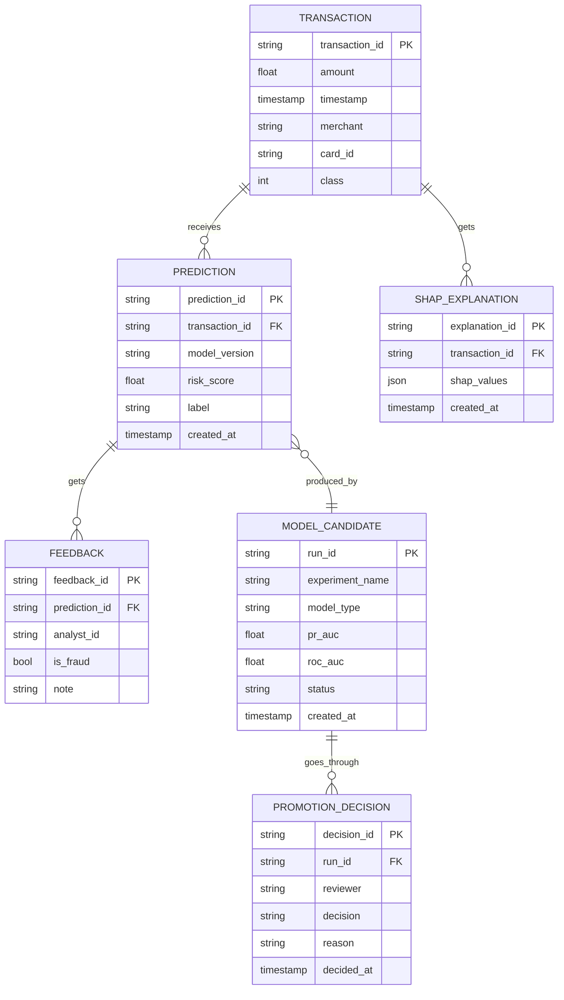

# Schema — FraudLens: Data Model

| Field | Value |
| --- | --- |
| Version | v0.1 |
| Last Updated | 2026-08-06 |
| Owner | Data Engineer |
| Status | In Review |

---

## 1. ER Diagram



## 2. Table/Collection Definitions

### TBL-transaction
| Field | Type | Nullable | Default | Constraints | Description |
| --- | --- | --- | --- | --- | --- |
| transaction_id | string PK | No | — | unique | tx id |
| amount | float | No | — | ≥ 0 | amount |
| timestamp | timestamp | No | — | — | when |
| merchant | string | Yes | — | — | merchant |
| card_id | string | No | — | — | masked card |
| class | int | No | 0 | 0/1 | label (fraud=1) |

### TBL-prediction
| Field | Type | Nullable | Default | Constraints | Description |
| --- | --- | --- | --- | --- | --- |
| prediction_id | string PK | No | — | unique | pred id |
| transaction_id | string FK | No | — | → transaction | parent |
| model_version | string | No | — | — | model used |
| risk_score | float | No | — | 0..1 | score |
| label | string | No | — | fraud/normal | label |
| created_at | timestamp | No | now() | — | when |

### TBL-shap_explanation
| Field | Type | Nullable | Default | Constraints | Description |
| --- | --- | --- | --- | --- | --- |
| explanation_id | string PK | No | — | unique | id |
| transaction_id | string FK | No | — | → transaction | parent |
| shap_values | json | No | — | — | per-feature values |
| created_at | timestamp | No | now() | — | when |

### TBL-model_candidate
| Field | Type | Nullable | Default | Constraints | Description |
| --- | --- | --- | --- | --- | --- |
| run_id | string PK | No | — | unique | MLflow run |
| experiment_name | string | No | — | — | experiment |
| model_type | string | No | — | xgboost/lightgbm/... | family |
| pr_auc | float | No | — | 0..1 | selection metric |
| roc_auc | float | No | — | 0..1 | secondary |
| status | enum | No | candidate | candidate/approved/rejected/serving | state |
| created_at | timestamp | No | now() | — | when |

### TBL-promotion_decision
| Field | Type | Nullable | Default | Constraints | Description |
| --- | --- | --- | --- | --- | --- |
| decision_id | string PK | No | — | unique | id |
| run_id | string FK | No | — | → model_candidate | candidate |
| reviewer | string | No | — | — | who decided |
| decision | enum | No | — | approve/reject | outcome |
| reason | text | Yes | — | — | why |
| decided_at | timestamp | No | now() | — | when |

## 3. Relationships & Foreign Keys

| Table A | Table B | On delete | Justification |
| --- | --- | --- | --- |
| prediction | transaction | cascade | predictions follow tx |
| shap_explanation | transaction | cascade | explanation belongs to tx |
| feedback | prediction | cascade | feedback on prediction |
| promotion_decision | model_candidate | cascade | decision follows candidate |

## 4. Indexes

| Table | Index | Columns | Type | Reason |
| --- | --- | --- | --- | --- |
| transaction | idx_tx_time | (timestamp) | btree | live monitor window |
| transaction | idx_tx_card | (card_id) | btree | card history |
| prediction | idx_pred_tx | (transaction_id) | btree | FK lookup |
| prediction | idx_pred_score | (risk_score) | btree | risk sort |
| model_candidate | idx_cand_status | (status) | btree | governance list |

## 5. Enums / Constants

| Enum | Allowed values |
| --- | --- |
| prediction.label | fraud, normal |
| model_candidate.status | candidate, approved, rejected, serving |
| promotion_decision.decision | approve, reject |
| DRIFT_THRESHOLD | 0.05 (config) |
| RETRAIN_FEEDBACK_THRESHOLD | config (e.g., 1000) |

## 6. Data Lifecycle

- Raw transactions retained per policy (90 days default, config).
- Predictions/explanations retained for audit.
- Soft-delete: N/A — hard retention jobs.
- Candidate models archived after decision.

## 7. Migrations Strategy

- Tool: Alembic (if SQLAlchemy persistence adopted; API also supports SQLite fallback).
- Rollback: `alembic downgrade -1`.

## 8. Sample Records

```json
{
  "transaction": { "transaction_id": "tx_123", "amount": 4500.0, "card_id": "****1234", "class": 1 },
  "prediction": { "transaction_id": "tx_123", "model_version": "xgboost_v3", "risk_score": 0.92, "label": "fraud" },
  "candidate": { "run_id": "run_abc", "model_type": "xgboost", "pr_auc": 0.91, "status": "candidate" }
}
```

## 9. Data Validation Rules

| Field | DB constraint | App layer |
| --- | --- | --- |
| amount | ≥ 0 | Pydantic validator |
| risk_score | 0..1 | Pydantic |
| class | 0/1 | Pydantic |
| status/decision | enum | Pydantic Literal |

## 10. Sensitive Data Map

| Field | Sensitivity | Encrypted at rest? | Masked in logs? |
| --- | --- | --- | --- |
| card_id | PCI-like | hash/truncate | masked `****1234` |
| amount | financial | — | — |
| analyst feedback | internal | — | — |
| LLM chat input | case data | — | redacted PII |
| API keys | credential | env only | never logged |

## 11. Related Documents

| Document | Relationship |
| --- | --- |
| [API.md](API.md) | Endpoints touching tables |
| [TechSpec.md](TechSpec.md) | MLflow/registry |
| [PRD.md](../product/PRD.md) | Requirements |
| [AppFlow.md](../design/AppFlow.md) | Governance flow |
| [Design.md](../design/Design.md) | Display fields |
| [ImplementationPlan.md](../project/ImplementationPlan.md) | Tasks |
| [Tracker.md](../project/Tracker.md) | Status |
| [Rules.md](../project/Rules.md) | Standards |
| [SecurityAndCompliance.md](SecurityAndCompliance.md) | Sensitive map |
| [Testing.md](Testing.md) | Data tests |
| [Deployment.md](Deployment.md) | Migrations |
| [Glossary.md](../reference/Glossary.md) | Vocabulary |
| [RiskRegister.md](../project/RiskRegister.md) | Risks |
