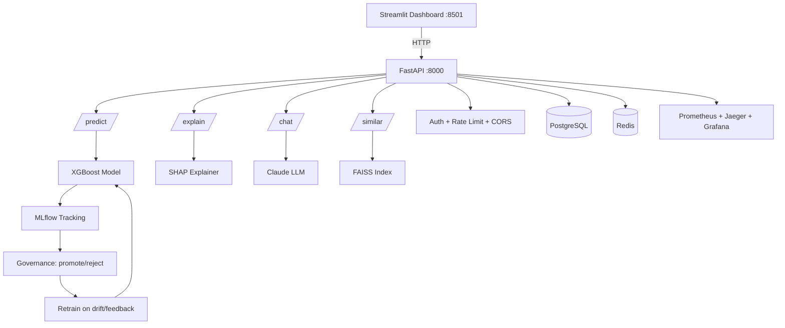
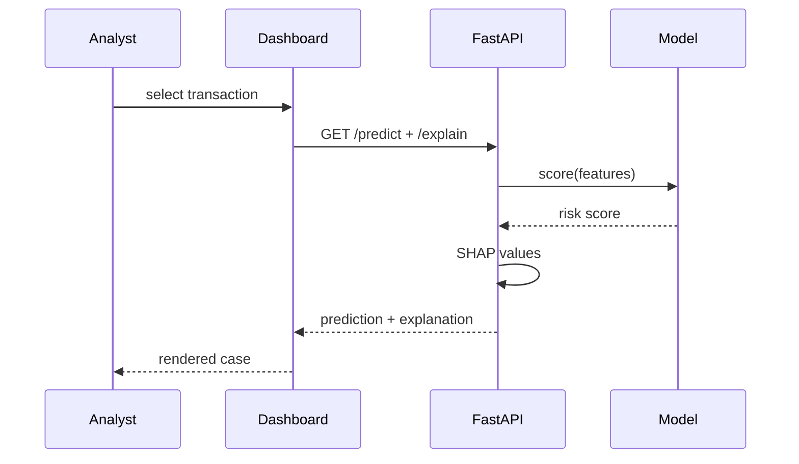
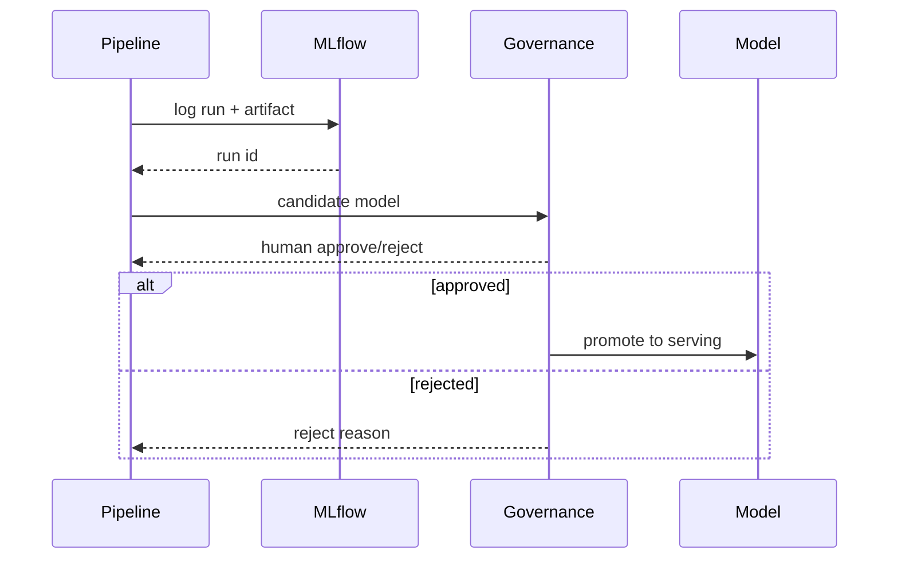
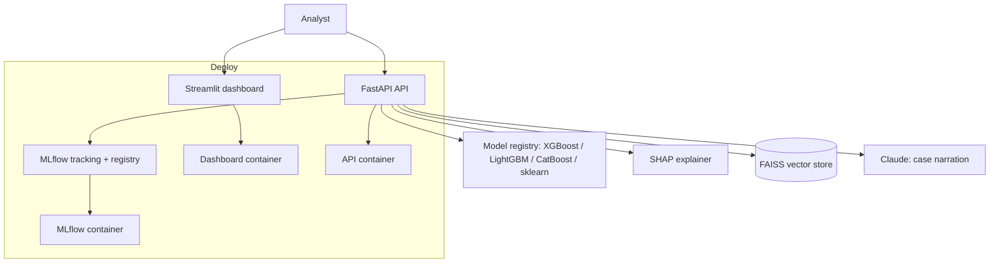

# TechSpec — FraudLens: Technical Specification

| Field | Value |
| --- | --- |
| Version | v0.1 |
| Last Updated | 2026-08-06 |
| Owner | Engineering Lead |
| Status | In Review |

---

## 1. Architecture Overview

## 2. Tech Stack Table

| Layer | Technology | Version | Justification |
| --- | --- | --- | --- |
| API | FastAPI + Pydantic v2 | 0.100+ | Async, typed schemas, OpenAPI |
| Models | XGBoost, LightGBM, sklearn, CatBoost | — | PR-AUC-first comparison |
| Preprocessing | imblearn (SMOTE-Tomek) | — | Class imbalance |
| Explainability | SHAP | — | Per-prediction attribution |
| LLM | Anthropic Claude (claude-sonnet-4) | — | Case narration |
| Vector search | FAISS | — | Similar-case RAG |
| Tracking | MLflow | — | Experiment + registry |
| Dashboard | Streamlit + Plotly | — | Analyst UI |
| Observability | Prometheus, Jaeger, Grafana | — | Metrics + tracing |
| Storage | PostgreSQL + Redis | 16 / 7 | State + cache |
| Config | pydantic-settings (env) | — | Env-driven |
| Testing | pytest | 8.x | Unit/integration |
| Deploy | Docker, K8s manifests | — | Containerized |

## 3. System Components

| Component | Responsibility | Inputs → Outputs | Scaling | Failure Modes |
| --- | --- | --- | --- | --- |
| FastAPI | Serve predict/explain/chat/similar | request → JSON | horizontal | auth/rate limit |
| Model service | Score transactions | features → risk | model server | model load failure |
| SHAP service | Feature attribution | features → SHAP values | in-process | slow on large data |
| LLM narrator | Plain-English cases | case data → narration | API quota | Claude down → fallback text |
| FAISS RAG | Similar cases | case → top-k | index in memory | index stale → rebuild |
| MLflow | Tracking + registry | run → artifact | shared server | down → train logs lost |
| Governance | Promote/reject | candidate → decision | human-in-loop | n/a |
| Dashboard | Analyst UI | API → charts | per-session | API down → error state |

## 4. Data Flow Diagrams

## 5. Third-Party Integrations

| Service | Purpose | Failure Fallback | Cost Model | Rate Limits |
| --- | --- | --- | --- | --- |
| Anthropic Claude | Narratives | deterministic template | token-based | quota |
| MLflow | Tracking | none (local sqlite alt) | self-hosted | n/a |
| Kaggle | Real dataset | synthetic generator | free | quota |
| PostgreSQL/Redis | State/cache | SQLite/in-memory fallbacks | self-hosted | n/a |

## 6. Non-Functional Requirements

| Category | Requirement | Target | How Verified |
| --- | --- | --- | --- |
| Performance | /predict p95 | < 200ms | Prometheus |
| Availability | API + dashboard uptime | 99.5% | healthchecks |
| Scalability | Batch + streaming prediction | 1000s tx/min | load test |
| Security | Auth, rate limits, CORS | enforced | tests |
| Observability | Metrics + traces | all endpoints | Prometheus/Jaeger |

## 7. Environments

| Env | URL | Data | Deploy |
| --- | --- | --- | --- |
| dev | localhost:8000/8501 | synthetic | make api / make dashboard |
| staging | staging | sample real | CI |
| prod | prod | real + MLflow | K8s/docker-compose |

## 8. Error Handling Strategy

- Pydantic validation → 422 with field errors.
- Model load failure → 503 + fallback.
- LLM failure → deterministic narration fallback.
- Retry/backoff on external calls; circuit breaker pattern for providers.
- Structured logging (structlog) with request IDs.

## 9. Observability

- Prometheus: request rate, error rate, p95 latency, cache hit ratio.
- Jaeger: tracing across API → model → LLM.
- Grafana: dashboards for API, model, drift, governance.
- Structured logs via structlog.

## 10. Technical Risks & Mitigations

| Risk | Mitigation |
| --- | --- |
| Class imbalance skews accuracy | PR-AUC metric, SMOTE resampling |
| LLM hallucination | Narration from deterministic tool outputs |
| Index staleness | Rebuild cadence + drift detection |
| Missing deps in env | requirements pinned; CI installs all |

## Deployment Topology

## 11. Related Documents

| Document | Relationship |
| --- | --- |
| [PRD.md](../product/PRD.md) | Requirements |
| [Schema.md](Schema.md) | Data model |
| [API.md](API.md) | Endpoint contracts |
| [AppFlow.md](../design/AppFlow.md) | Flows |
| [Design.md](../design/Design.md) | Dashboard design |
| [ImplementationPlan.md](../project/ImplementationPlan.md) | Phases |
| [Tracker.md](../project/Tracker.md) | Status |
| [Rules.md](../project/Rules.md) | Standards |
| [SecurityAndCompliance.md](SecurityAndCompliance.md) | Data protection |
| [Testing.md](Testing.md) | Tests |
| [Deployment.md](Deployment.md) | Environments |
| [Glossary.md](../reference/Glossary.md) | Vocabulary |
| [RiskRegister.md](../project/RiskRegister.md) | Risks |
