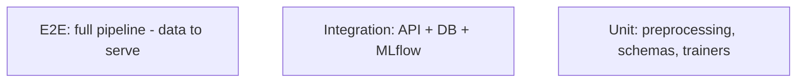

# Testing — FraudLens: Test Strategy

| Field | Value |
| --- | --- |
| Version | v0.1 |
| Last Updated | 2026-08-06 |
| Owner | QA Engineer |
| Status | In Review |

---

## 1. Test Pyramid

## 2. Strategy

| Layer | Tool | Scope |
| --- | --- | --- |
| Unit | pytest | Preprocessing, resamplers, schemas, trainer interfaces |
| Integration | pytest + TestClient | API endpoints, rate limiting, model load |
| Pipeline | pytest | data → train → artifact end-to-end |
| Security | pytest | auth, rate limits, validation |

> Note: local test collection currently fails when optional deps (structlog, imblearn, lightgbm) are missing — install full requirements before running (see ../project/Tracker.md BLK-001).

## 3. Critical Test Cases

| ID | Feature | Case | Expected |
| --- | --- | --- | --- |
| TC-001 | Preprocessing | SMOTE-Tomek resample | Balanced classes, valid shapes |
| TC-002 | Training | Trainer runs on small synthetic | Artifact produced |
| TC-003 | Predict | Valid request | Risk score 0..1 |
| TC-004 | Predict | Invalid amount | 422 with field error |
| TC-005 | Explain | SHAP for transaction | Values per feature |
| TC-006 | Similar | FAISS query | Top-k similar cases |
| TC-007 | Chat | LLM down | Template fallback |
| TC-008 | Auth | Missing API key | 401 |
| TC-009 | Rate limit | Burst of requests | 429 after limit |
| TC-010 | Governance | Promote/reject flow | Decision persisted |

## 4. Test Data Strategy

- Synthetic dataset (5,000 tx) for reproducibility; Kaggle fallback.
- Fixtures with injected fraud patterns.

## 5. CI Gates

- `make test` green.
- `make test-cov` ≥ 70%.
- Ruff lint; gitleaks.

## 6. Related Documents

| Document | Relationship |
| --- | --- |
| [Rules.md](../project/Rules.md) | Coverage requirements |
| [PRD.md](../product/PRD.md) | Release criteria |
| [TechSpec.md](TechSpec.md) | Components |
| [AppFlow.md](../design/AppFlow.md) | Flow tests |
| [Schema.md](Schema.md) | Data tests |
| [API.md](API.md) | Contract tests |
| [Design.md](../design/Design.md) | UI tests |
| [ImplementationPlan.md](../project/ImplementationPlan.md) | Test tasks |
| [Tracker.md](../project/Tracker.md) | BLK-001 |
| [SecurityAndCompliance.md](SecurityAndCompliance.md) | Security tests |
| [Deployment.md](Deployment.md) | Test env |
| [Glossary.md](../reference/Glossary.md) | Vocabulary |
| [RiskRegister.md](../project/RiskRegister.md) | Risks |
